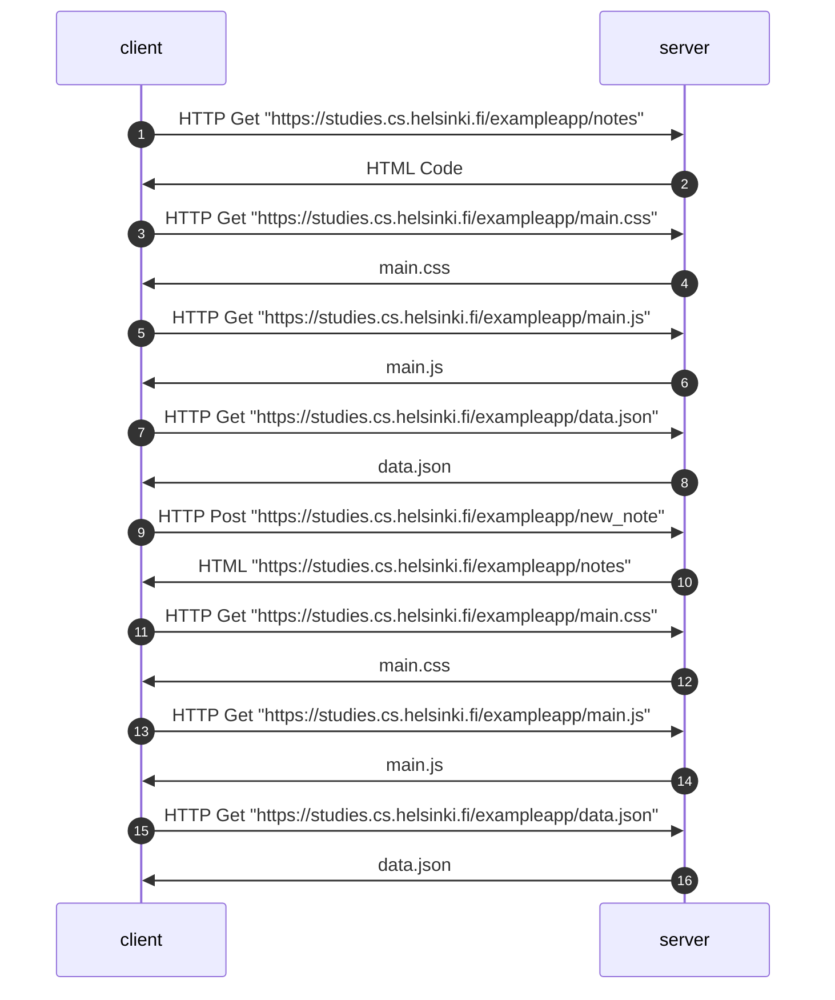

```mermaid

sequenceDiagram
    autonumber
    participant client
    participant server
    client->>server: HTTP Get "https://studies.cs.helsinki.fi/exampleapp/notes"
    server ->> client : HTML Code
    client ->> server : HTTP Get "https://studies.cs.helsinki.fi/exampleapp/main.css"
    server ->> client : main.css
    client ->> server : HTTP Get "https://studies.cs.helsinki.fi/exampleapp/main.js"
    server ->> client : main.js
    client ->> server : HTTP Get "https://studies.cs.helsinki.fi/exampleapp/data.json"
    server ->> client : data.json
    client ->>  server : HTTP Post "https://studies.cs.helsinki.fi/exampleapp/new_note"
    server ->> client : HTML "https://studies.cs.helsinki.fi/exampleapp/notes"
    client ->> server : HTTP Get "https://studies.cs.helsinki.fi/exampleapp/main.css"
    server ->> client : main.css
    client ->> server : HTTP Get "https://studies.cs.helsinki.fi/exampleapp/main.js"
    server ->> client : main.js
    client ->> server : HTTP Get "https://studies.cs.helsinki.fi/exampleapp/data.json"
    server ->> client : data.json
```